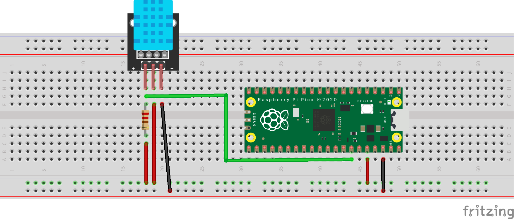
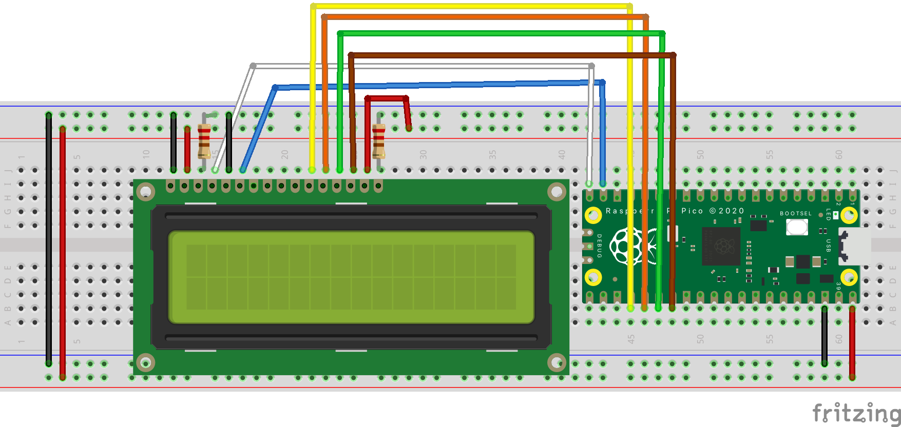

# rust-rpicow-discovery
Embedded Rust with Raspberry Pi Pico(w)

## Pico Pinout
[Pico Pinout](https://pico.pinout.xyz/)

## Examples
This project uses probe-run to run the examples. Once set up, it should be as simple as `cargo run --example <example name> --release`.

### DHT11 sensor

### HD44780 / 1602A LCD

HD44780 | RPi Pico | Function
--------|-------------|---------
1 (Vss) | Ground (0V) | Powers the HD44780's processor
2 (Vdd) | 5V | Powers the HD44780's processor
3 (V0) | Ground (0V) via a 1K resistor | LCD contrast control: high for nothing, low for aggressive white squares that hate you
4 (RS) | Pi Pico GP15 (pin 20) | Register Select. High to send data, low to send instructions (like 'clear screen').
5 (R/W) | Ground (0V) | Read/write toggle. I've kept it permanently tied low since we only ever output to the display.
6 (E) | Pi Pico GP14 (pin 19) | Enable signal.
11, 12, 13, 14 (DB4-DB7) | GP18, GP19, GP20, GP21 (pins 24-27) | Data pins.
15 (BLA) | 5V | Backlight LED anode.
16 (BLK) | Ground (0V) via 220 ohm resistor| Backlight LED cathode.

